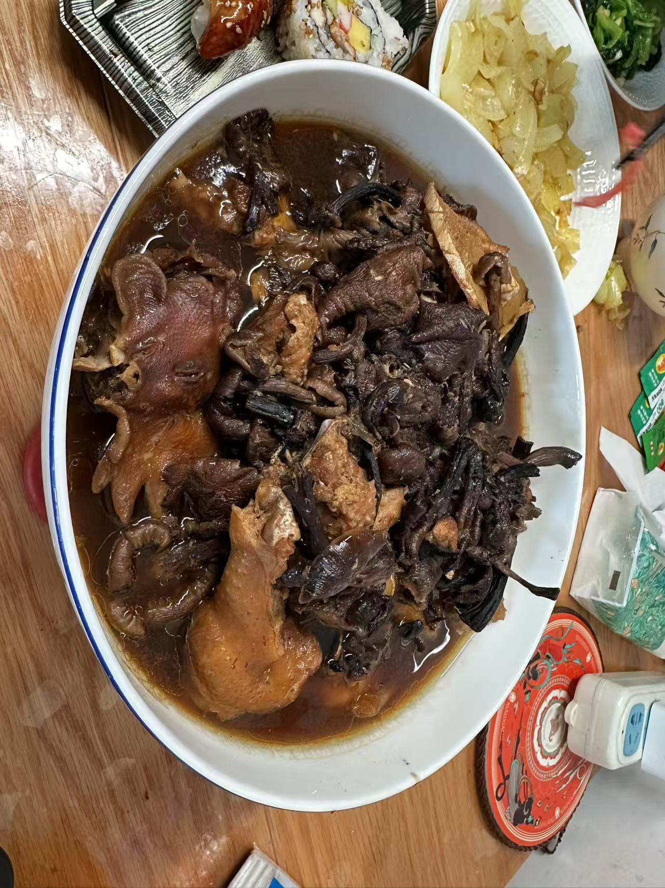

以下是小鸡炖蘑菇的常见做法：

准备食材

- 挑选鸡肉：建议选用三黄鸡或土鸡，整鸡或者将其分割成合适的块状都可以，这样鸡肉的口感和香味会更加浓郁。
- 准备蘑菇：以榛蘑为最佳，也可以使用干香菇代替。干蘑菇需要提前用温水泡发2-3小时，泡发后洗净泥沙，泡蘑菇的水保留备用。
- 其他配料：葱、姜、蒜适量，八角2-3颗，干辣椒3-4个，料酒2-3勺，生抽2勺，老抽1勺，白糖1小勺，盐和鸡精适量，食用油适量。

烹饪菜肴

- 处理鸡肉：将鸡肉清洗干净，切成大小均匀的块状。冷水下锅，加入1-2片姜片、少许料酒，进行焯水，水开后煮3-5分钟，撇去浮沫，捞出沥干水分。
- 炒制香料：锅中倒入适量食用油，油热后放入葱段、姜片、蒜粒、八角、干辣椒，小火慢慢煸炒，炒出香味。
- 煎炒鸡肉：将焯好水的鸡肉块放入锅中，保持中火，慢慢煎炒，让鸡肉的每一面都煎至微微金黄，这样可以锁住鸡肉的汁水，使其口感更加嫩滑。
- 调味上色：鸡肉煎好后，加入料酒去腥，接着加入生抽提鲜、老抽上色，再放入白糖调味，翻炒均匀，让鸡肉均匀裹上调料。
- 加水炖煮：往锅中加入没过鸡肉块的清水，或者直接加入泡蘑菇的水，大火烧开后转小火，盖上锅盖，炖煮30-40分钟。
- 放入蘑菇：待鸡肉炖煮至七八成熟时，放入泡发好的蘑菇，继续炖煮20-30分钟，直到鸡肉熟透，蘑菇入味。
- 收汁调味：最后根据个人口味加入适量的盐和鸡精进行调味，然后开大火收汁，让汤汁变得浓稠一些，即可出锅。
- 粉条也是很重要的一部分，在制作过程中可以加入一些粉条来增加口感。

